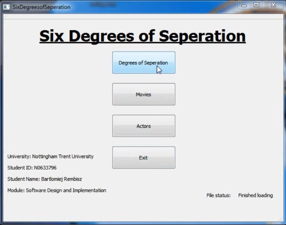

# Six Degrees of Seperation
A GUI application built with C++ and Qt simulating the theory of the Six Degrees of Seperation using a movie database consisting of 1000 movies and around 45000 actors.
The Six Degrees of Seperation is a theory stating that every person on Earth is seperated by up to 6 acquaintances (decreasing over time due to social media development), this project simulates this theory by using a dataset of movies and actors. Two actors are acquaintanced if they played in the same movie together.
The connection is found using a Breadth First Search algorithm by iterating through a network of actors.

## Usage:
- Open the application
- Wait for everything to initialize (takes up to 2 seconds)
- Choose 'Degrees of Seperation' in main menu
- Choose two actors
- Click 'Find Connection'
The output is the path from one actor to the other and the degrees seperating them

## Dependencies:
- Qt GUI framework
- rapidjson JSON parsing library

### Screen Shots:

Main screen:

Connection choice:

Final program output:

